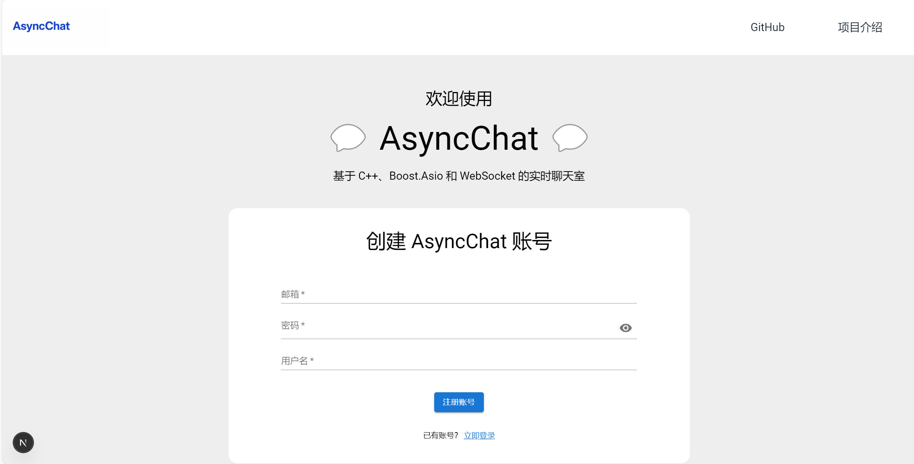
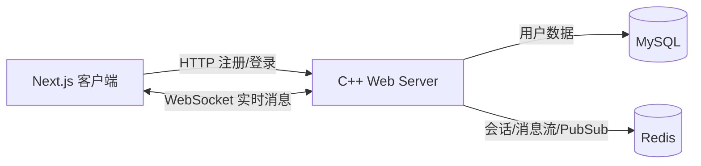

# AsyncChat

基于 **C++17、Boost.Asio、Boost.Beast、WebSocket、Redis、MySQL 和 Next.js** 的实时网络聊天室。

本项目以异步网络编程为核心，覆盖账号认证、会话管理、聊天室消息广播和历史消息读取，并提供中文 Web 界面及自动化测试。

<!-- 将实际聊天界面截图保存为 doc/images/asyncchat-demo.png 后，删除下一行两端的注释符号 -->
<!--  -->

## 项目功能

- 用户注册与登录，包含邮箱、密码和用户名校验
- 基于 Cookie 的身份认证与 Redis 会话管理
- 基于 WebSocket 的实时双向通信
- 多聊天室切换、消息广播与历史消息加载
- MySQL 持久化用户数据，Redis 存储会话及聊天消息
- Next.js + React + TypeScript 实现的中文响应式界面
- Jest、Testing Library、CTest 和 Pytest 测试支持

## 技术架构



| 模块 | 技术 | 作用 |
| --- | --- | --- |
| 网络服务 | C++17、Boost.Asio、Boost.Beast | 异步 HTTP 服务与 WebSocket 长连接 |
| 数据交换 | Boost.JSON | 请求、响应和聊天事件序列化 |
| 用户数据 | MySQL | 用户账号及密码摘要持久化 |
| 实时数据 | Redis | Session、消息流及跨会话发布订阅 |
| Web 客户端 | Next.js、React、TypeScript、MUI | 注册、登录和聊天室界面 |
| 测试 | Jest、Testing Library、CTest、Pytest | 前端组件、服务端逻辑和接口测试 |

服务端采用单线程事件循环，并通过 Boost.Asio 栈式协程组织异步流程。用户完成认证后，客户端建立 WebSocket 连接；服务端读取并存储消息，再通过 Redis Pub/Sub 向聊天室内的连接广播。

## 个人实践内容

本项目基于开源项目 `anarthal/servertech-chat` 进行学习和二次开发，个人完成的工作主要包括：

- 在 Linux 环境中搭建并调试 C++、Boost、MySQL、Redis 和 Node.js 开发环境
- 梳理 HTTP 注册/登录、Cookie Session 与 WebSocket 消息链路
- 完成 AsyncChat 品牌替换、中文界面适配和聊天室名称调整
- 调整前后端配置，处理 Boost/MySQL 连接及编译运行问题
- 更新前端单元测试与快照，使测试与中文界面保持一致
- 验证注册、登录、房间切换、实时消息和历史消息等核心流程

## 目录结构

```text
.
├── client/             # Next.js 前端及 Jest 测试
├── server/             # C++ 服务端源码、头文件及 CTest 测试
├── test/integration/   # Python 接口与 WebSocket 集成测试
├── doc/                # 项目文档与静态资源
├── docker-compose.yml  # MySQL、Redis 与服务端容器配置
└── README.md
```

## 本地运行

### 环境要求

- 支持 C++17 的编译器
- CMake 3.16+
- Boost（Context、JSON、Regex、URL、Charconv 等组件）
- OpenSSL、ICU
- MySQL 8、Redis
- Node.js 与 npm

### 1. 启动基础服务

```bash
sudo systemctl start mysql
sudo systemctl start redis-server
```

请确保本机 MySQL 的账号、密码和认证方式与服务端配置一致。

### 2. 编译并启动服务端

```bash
cd server
mkdir -p build
cd build
cmake ..
cmake --build . -j4
./main 0.0.0.0 8080 ../../doc
```

服务端启动后监听 `http://localhost:8080`。

### 3. 启动前端

新开一个终端：

```bash
cd client
npm ci
npm run dev
```

浏览器访问 `http://localhost:3000`。

## 测试

前端测试：

```bash
cd client
npm test -- --runInBand
```

当前本地测试结果：**13 个测试套件、34 个测试、20 个快照全部通过**。

C++ 测试：

```bash
cd server/build
ctest --output-on-failure
```

集成测试位于 `test/integration/`，需要在 MySQL、Redis 和服务端正常运行后执行。

## 后续计划

- 将数据库连接参数迁移至环境变量，减少环境耦合
- 恢复并完善 GitHub Actions 持续集成
- 增加服务端并发、异常路径和安全性测试
- 补充 Docker Compose 一键启动验证与部署文档

## 项目来源与许可证

本项目基于 [anarthal/servertech-chat](https://github.com/anarthal/servertech-chat) 进行学习和二次开发，感谢原作者提供的项目架构与实现。

项目遵循 [Boost Software License 1.0](LICENSE_1_0.txt)。原项目文档可参考 [ServerTech Chat Documentation](https://anarthal.github.io/servertech-chat/)。
